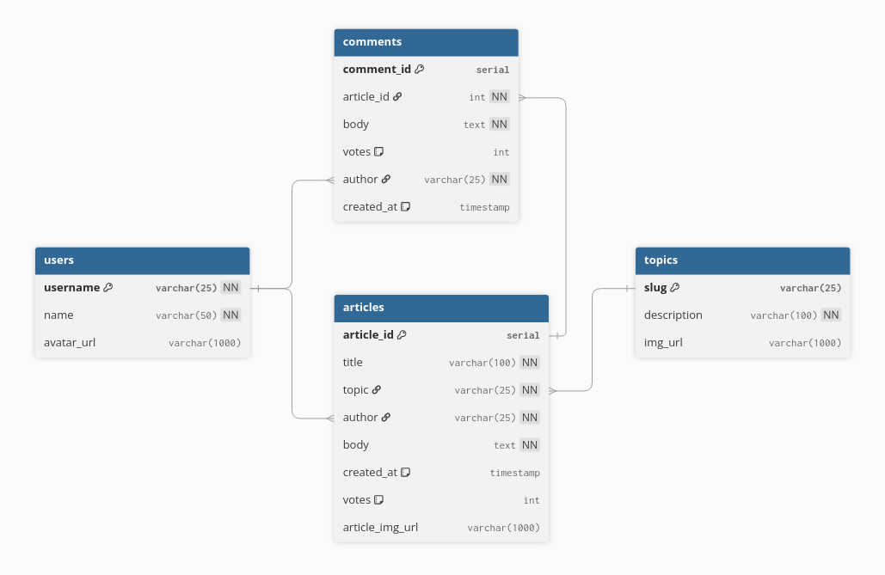

# Subnet - A reddit style app (but better)

[https://subnet-be.onrender.com]()

A RESTful API backend for a social news platform, built with Node.js. This API provides core functionality for user management, article publishing, commenting, voting and topic-based organization.

## Features

- Create and manage articles
- Vote and comment on articles
- Organize content by topics
- User profiles

## Tech Stack

- **Runtime:** Node.js
- **Framework:** Express
- **Database:** PostgreSQL
- **Authentication:**
- **Validation:**

## Schema

